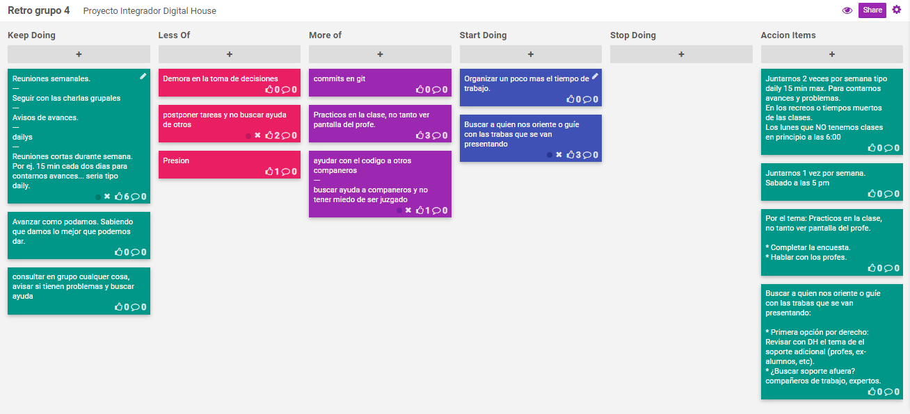

## Retrospectiva

Para la retrospectiva se utilizo la herramienta [FunRetro](https://funretro.io). Para ver el contenido ingresar al siguiente link [retrospectiva](https://funretro.io/publicboard/zsFx3lrmUKfh6RLmRHQxZ9ZeNAp1/982ec562-fdbc-435b-83f7-e2403cef8c3b).

### Imagen tablero retrospectiva

